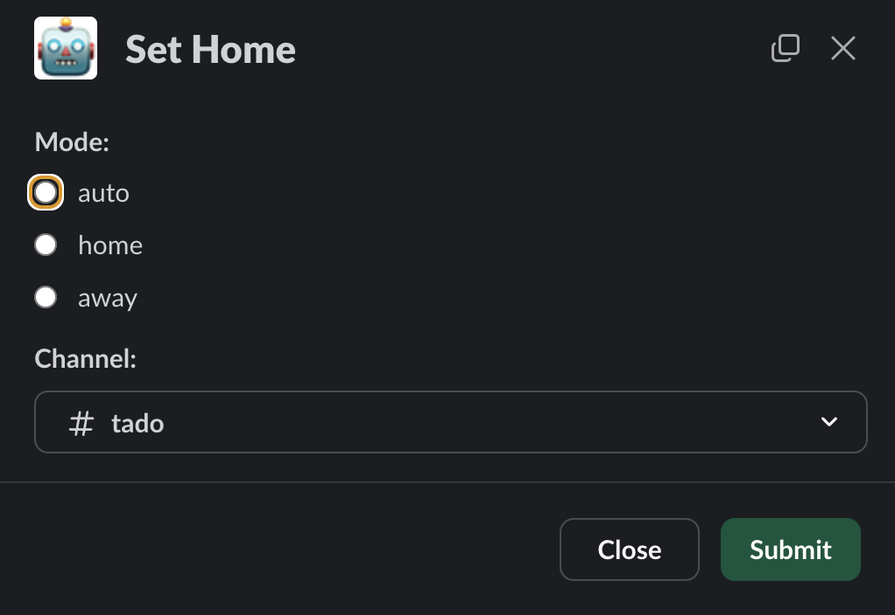

# Tadoº exporter & controller
[](https://github.com/clambin/tado-exporter/releases)
[](https://app.codecov.io/gh/clambin/tado-exporter)
[](https://github.com/clambin/tado-exporter/actions)
[](https://goreportcard.com/report/github.com/clambin/tado-exporter)
[](LICENSE.md)

Monitor & control utility Tadoº Smart Thermostat devices.

## :warning: Breaking change in v0.18.0
v0.18.0 changes the way tado authenticates itself with the Tado API. This requires user intervention. 
See [Tadoº credentials](#tadoº-credentials) for details.

## Features

tado retrieves all metrics from your Tadoº devices and makes them available to Prometheus. Additionally, tado can run:

- a rule-based controller to set the heating based on current conditions, like:
  - switching on/off the heating in a room, when designated users are home or away
  - switching off a manual overlay after a specific amount of time
  - switching off a manual overlay at a specific time of the day
  - switching off all heating when all users are away (basic geofencing implementation)
- a Slack bot to query and control heating in a room

## Installation

Container images for `tado monitor` are available on [ghcr.io](https://github.com/clambin/tado-exporter/pkgs/container/tado-monitor).

## Running
### Command-line options

The following command-line arguments are supported:

```
Usage:
tado [command]

Available Commands:
completion  Generate the autocompletion script for the specified shell
help        Help about any command
monitor     Monitor Tado thermostats
```

### Configuration file

The configuration file option specifies a yaml file to control the behaviour:

```
# Set to true to enable debug logging
debug: false
# Section for Prometheus exporter functionality
exporter:
    # Listener address for the Prometheus metrics server
    addr: :9090
# Section related to polling Tado for new metrics
poller:
    # How often we should poll for new metrics
    interval: 30s
# Section related to the /health endpoint
health:
    # Listener address for the /health endpoint
  addr: :8080
# Section containing Tado configuration
tado:
    auth:
        # location to store the authentication token
        path: /tmp/tado-token.enc
        # passphrase to encrypt the stored authentication token
        passphrase: ""
slack:
    # Slack token. If added, rule events are sent to Slack 
    token: xoxb-token
    # Slack App token. If added, the Slack bot is started.  Requires "token".
    app-token: xapp-token
```

If the filename isn't specified on the command line, the program looks for a file `config.yaml` in the following directories:

```
/etc/tado-monitor
$HOME/.tado-monitor
.
```

You can override any value in the configuration file by setting an environment variable with a prefix `TADO_MONITOR_`. 
For example, to avoid setting your Tadoº credentials in the configuration file, set the following environment variables:
s
```
export TADO_MONITOR_TADO.USERNAME="username@example.com"
export TADO_MONITOR_TADO.PASSWORD="your-password"
```

## Tadoº credentials
In previous releases, tado used the user's username and password to access the Tadoº API. However, as announced [here](https://github.com/home-assistant/core/issues/138518),
Tadoº are decommissioning this flow on 15 March 2025 and applications need to be modified to use device codes for authentication.

While more secure, this does require manual action from the user.  When tado first starts up, you will see the following prompt:

```aiignore
No token found. Visit https://login.tado.com/oauth2/device?user_code=<device-code> and log in ...
```

After opening this link and confirming the login request, tado will be issued a token and will operate as per normal.

To avoid user action on every startup, tado stores the active token to a file, as specified by tado.auth.path in the configuration file,
using tado.auth.passphrase as the encryption passphrase.

Note: tokens have a lifetime of 10 minutes, meaning if tado is not running for 10 minutes, you will need to confirm the login again.

## Prometheus

### Adding tado as a target

Add tado as a target to let Prometheus scrape the metrics into its database.
This highly depends on your particular Prometheus configuration. In its simplest form, add a new scrape target to `prometheus.yml`:

```
scrape_configs:
- job_name: tado
  static_configs:
  - targets: [ '<tado host>:<port>' ]
```

where `port` is the Prometheus listener port configured in `exporter.addr`.

### Metrics

See [METRICS.md](METRICS.md) for details.

### Grafana

The repo contains a sample [Grafana dashboard](assets/grafana/dashboards) that displays the scraped metrics. Feel free to customize as you see fit.

## Slack bot

`tado monitor` can run a Slack bot that reports on any rules being triggered:


Users can also interact with the bot:


The tado bot implements a Slash command `/tado`, with the following options:

* **rules**: show any activated rules
* **rooms**: show temperature & settings on each room
* **users**: show the status of each user (home/away)
* **refresh**: get the latest Tadoº data
* **help**: show all supported options

The bot includes two interactive shortcuts: `Tado Room` controls a room's heating, `Tado Home` controls the house:

| Tado Room                       | Tado Home |
|---------------------------------|-----------|
|  |  |


To enable the bot, go to You Apps in your workspace and add a Tadoº Bot using the included [manifest.yaml](assets/slack/manifest.yaml).
Add the App Token and the Bot User OAuth Token in `slack.app-token` and `slack.token` respectively.

## Controlling your tadoº devices

`tado monitor` implements a rule-based system to control the heating devices in your home. It supports two types of rules: home rules and zone rules.

### Home rules
Home rules control the state of the home itself, i.e. automatic, home or away.  One packaged rules are included:
- `homeandaway` switches the home to HOME or AWAY depending on whether any users are home (using a user's geotracked device to determine of they're home).

### Zone rules
Zone rules control the state of the devices in a Tadoº zone, i.e. automatic (controlled by a schedule), on or off. Three rules are included:

- `limitoverlay` switches the heating to auto mode after one hour.
- `nighttime` switches the heating to auto mode during a period of the day.
- `autoaway` switches the heating of a zone off if its users are away, giving you more granular control than a home rule

### Configuration
`tado monitor` looks for a file `rules.yaml` in the same directory as the `config.yaml` file.
This file defines the rules to apply for your home:

```
home:
  - name: autoAway:
    script:
      packaged: homeandaway
      users: [ "user A", "user B"]
zones:
  Study:
    - name: autoAway
      script:
        packaged: autoaway
      users: [ user ]
  Bathroom:
    - name: limitOverlay
      script:
        packaged: limitoverlay
```

If the file doesn't exist, `tado monitor` only runs as a Prometheus exporter.

### Custom rules
`tado monitor`'s rule system can be extended by creating new rules as Lua scripts. 

#### Custom home rules
Create a Lua script that has the following function:

```
function Evaluate(state, devices, args)
  --- determine the desired state, based on the home state, devices and args
    return state, delay, reason
end
```

Refer to [homerules](internal/controller/rules/homerules) as an example.

To use your custom rule, configure it in `rules.yaml`. Either save the script directly in the rules file:

```
- name: "my customer rule"
  script:
    text: |
      function Evaluate(state, devices, args)
        --- your rule
        return state, delay, reason
      end
```

Alternatively, save the script to a file and reference it in the rules file:

```
- name: "my customer rule"
  script:
    path: myscript.lua
```

You can evaluate your custom rule by running `tado eval home <your script>`:

```aiignore
$ tado eval home --action-only my-script.lua 
INPUT                                                                                      CHANGE REASON                                   ACTION
home(overlay:false,home:false) user(home:true)                                             true   one or more users are home: user         setting home to HOME mode in 0s
home(overlay:false,home:true) user(home:false)                                             true   all users are away: user                 setting home to AWAY mode in 5m0s
home(overlay:true,home:false) user(home:true)                                              true   one or more users are home: user         setting home to HOME mode in 0s
home(overlay:true,home:true) user(home:false)                                              true   all users are away: user                 setting home to AWAY mode in 5m0s
```

This runs through all possible combination of the home state & devices and shows the response. By adding `--action-only`, 
the tool only lists the combinations that result in a state change (i.e. an "action").


##### Custom zone rules
Creating a zone rule is similar to creating a home rule, except for the function signature:

```
function Evaluate(homestate, zonestate, devices, args)
  --- your rule
  return zonestate, delay, reason
end
```

Use `tado eval zone <your script>` to test your custom rule.

See [zonerules](internal/controller/rules/zonerules) for examples.

## Tadoº client implementation

tado uses the Tadoº Go Client found at [GitHub](https://github.com/clambin/tado). Feel free to reuse for your own projects.

## Authors

* **Christophe Lambin**

## Acknowledgements

* [tado OpenAPI specification](https://github.com/kritsel/tado-openapispec-v2) by [Kristel](https://github.com/kritsel).
* Max Rosin for his [Python implementation](https://github.com/ekeih/libtado) of the Tado API
* [vide/tado-exporter](https://github.com/vide/tado-exporter) for some inspiration

## License

This project is licensed under the MIT License - see the [LICENSE.md](LICENSE.md) file for details.
